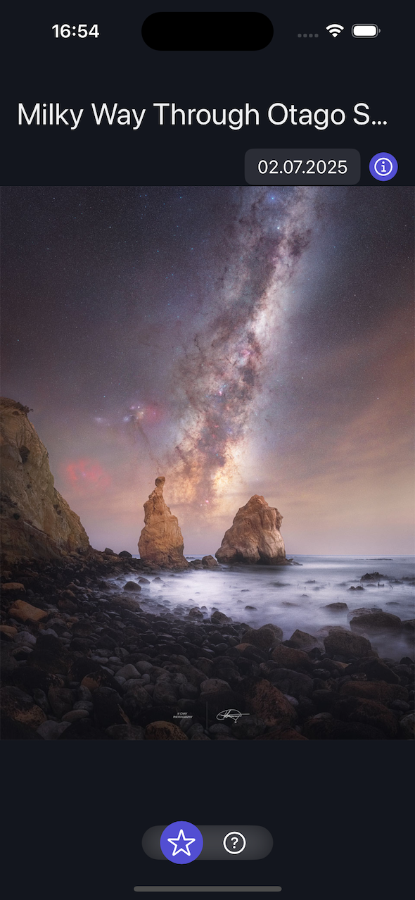

# apod

An App for displaying astronomy pictures for a specifc date.
While building the app, I tried to keep it simply and make use of SwiftUI's reactive system.




More information: [Github nasa/apod-ai](https://github.com/nasa/apod-api)

## How to run
The debug environment is authorized with a demo key, which only allows very limitted hourly and daily requests.
You can obtain a API key here [NASA - sign up](https://api.nasa.gov/#signUp).

```
// You can either change the default environment here or create a complete custom environment in case you hosted the api differently.
extension APODEnvironment {
    static var `default`: APODEnvironment {
#if DEBUG
        return .debug
#else
        return .prod(apiKey: "CHANGE_ME")
#endif
    }
}

```

## Architecture notes

Generally the the architecture is kept simple and uses MV.
However, it is being designed in a way, that allows to change the presentation layer if needed.
There are 3 main layers that make up the App.

### Core
This layer contains the foundation for all parts of the code. The code can be shared and does not depend on any other part of the app.

Examples:
- Networking
- Commonly used helpers

### Domain
The domain handles the main business logic of the application. It is responsible for domain-specific data retrieval, manipulation and storage.
The main interface for each domain is provided by a aggregate model (e.g. `AstronomyMedia.swift`), that holds the current domain state and allows accesss to all functions of that domain. It is basically the *Model* in *MV*.

### App
The app layer contains platform specifc app code. It utilizes the domain layer to display UI.
The Views are separated into two categories *Pages* and  *Components / normal views*.

**Pages**

Each Page View represents a entire screen. These are not intended to be reused and are mostly tight to specific domains or features.
NOTE: Only pages should have direct access to objects passed via the `Environment`. This avoids overuse of it and allows for reusablility of other UI components.

**Other views / UI components**

Domain independent views that can be reused.
NOTE: Should not acces `Environment` to allow for easier reuse.
